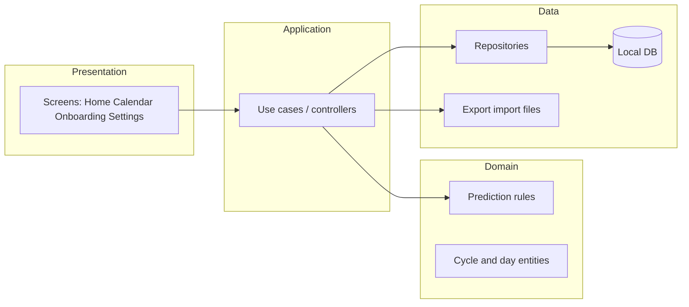

# Architecture Research

**Domain:** Local-first mobile cycle tracker  
**Researched:** 2026-04-04  
**Confidence:** MEDIUM (patterns standard; concrete package layout TBD at implementation)

## Typical Component Boundaries

## Data Flow

1. **Write path:** UI → use case → validate → persist → invalidate read models / streams  
2. **Read path:** UI observes repository streams or Future providers; calendar aggregates per month  
3. **Prediction:** Pure function(s) over ordered period history → estimates + confidence flags (no network)  
4. **Export/import:** Serialize canonical domain + schema version ↔ file; import runs validation then transactional write

## Suggested Build Order (dependencies)

1. **Domain + tests:** entities, prediction rules (TDD), export DTOs  
2. **Persistence:** DB schema, migrations, repository integration tests  
3. **Minimal UI shell:** navigation, theme, empty states  
4. **Logging flows** then **calendar** then **home**  
5. **Export/import** with round-trip tests  
6. **Lock** and polish: accessibility, copy, performance passes

## Flutter-Specific Notes

- Prefer **thin widgets**; keep rules and I/O out of `build()` methods  
- **FVM** ensures CI and developers run the same SDK for golden/widget tests  
- Consider a small **feature folder** structure (`features/logging`, `features/calendar`, …) or layered `data` / `domain` / `presentation` — decide in Phase 1 plan

## Trace to PRD

- **Offline-first:** no service locator for “remote API” in Phase 1  
- **Determinism:** prediction module documented alongside code (README or in-app “how we predict”)  
